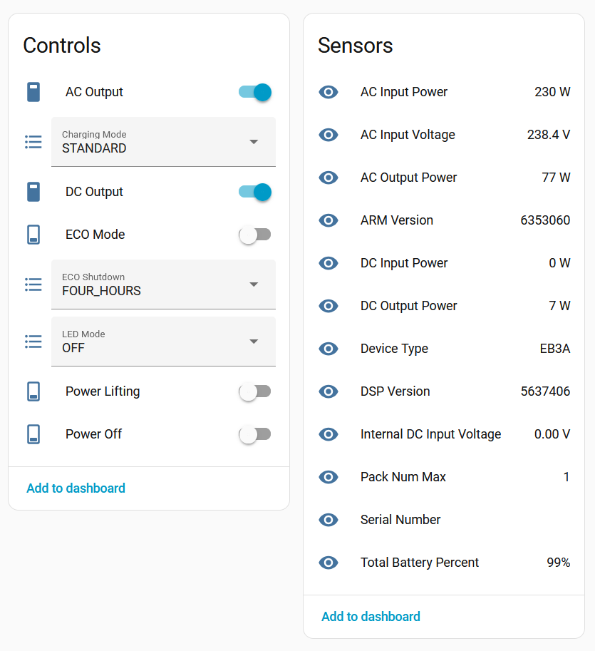

# ESPHome config for Bluetti EB3A

I use a Bluetti EB3A as a UPS for my home server and network gear. It works well,
however if the power goes out and the battery completely discharges, it does not
re-enable the AC and DC power outputs when the mains power turns on again.

This project communicates to an EB3A via bluetooth and, once per minute, turns on
the AC and DC power outputs. It also grants MQTT control and monitoring to everything
exposed on the EB3A's bluetooth interface.

## Setup

Find your battery's Bluetooth MAC address with the 'nRF Connect' app on your phone,
or any other means. Populate the `bt_bluetti_mac` variable at the top of the file.
Set your ESPHOME OTA password, wifi and MQTT credentials as required.

## Notes

This prioritises the Bluetooth connection over WiFi, as the WiFi might be down when
recovering from a power outage. It doesn't enable the WiFi until the Bluetooth has
connected.

## Extra

I initially tried to make this work by writing a generic UART bridge/proxy that could
be written to from the Bluetooth interface, and read into the Modbus controller. This
turned out to be too much work, so I patched a `inject_modbus_byte()` onto the
Modbus component instead.

Some Bluetti batteries have an encryption layer between Bluetooth and Modbus. Check
out [this repo](https://github.com/warhammerkid/bluetti_mqtt.git) for details on that.